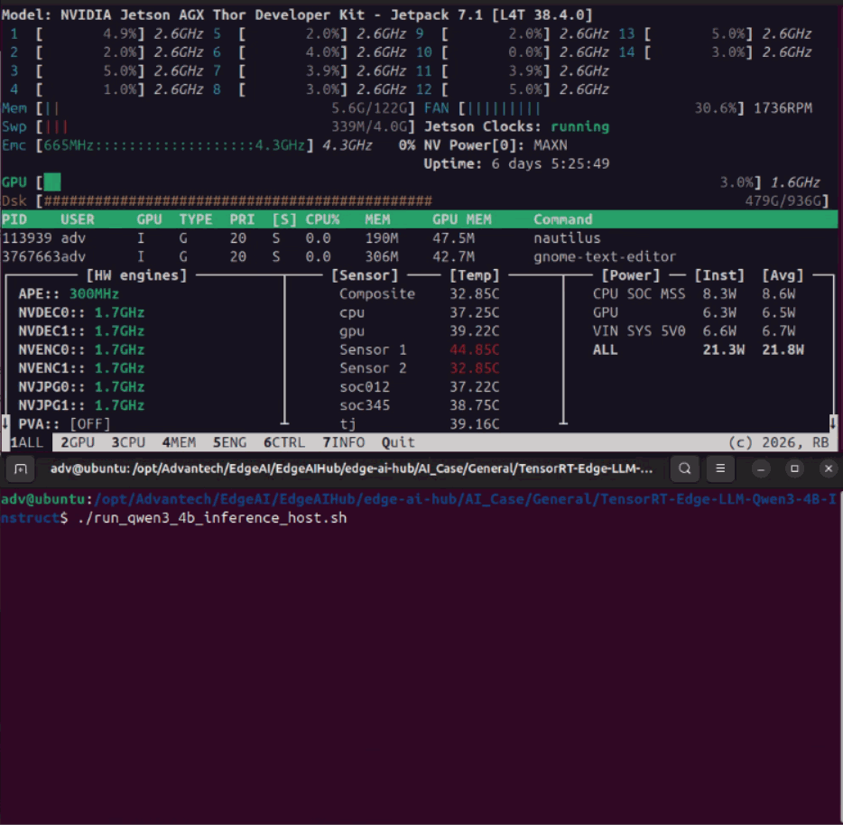

# TensorRT Edge-LLM Qwen3-4B-Instruct

TensorRT Edge-LLM Qwen3-4B-Instruct provides on-device large language model inference for edge devices, enabling real-time text generation and instruction-following inference on NVIDIA Jetson Thor. It is suitable for rapid PoC and production deployment in industrial AI assistants, robotics control interfaces, edge chatbot services, and private on-premises GenAI scenarios.

Upstream project: [TensorRT Edge-LLM on Jetson](https://www.jetson-ai-lab.com/tutorials/tensorrt-edge-llm/)

- **Category**: General-purpose Edge LLM



## NVIDIA TensorRT Edge-LLM

- **Qwen3-4B-Instruct LLM**
 Qwen3-4B-Instruct is used as the target text-only LLM for instruction-following, text generation, and edge-side chatbot inference.

- **TensorRT Edge-LLM Inference Pipeline**
 The Hugging Face model is downloaded on Jetson Thor, quantized to NVFP4, exported to ONNX, compiled into a TensorRT engine, and executed through the native C++ inference binary.

- **NVFP4 Runtime Optimization**
 NVFP4 quantization is used on Jetson Thor to reduce model weight footprint and improve edge deployment feasibility with TensorRT engine optimization.

## Supported Platform

| Platform | Hardware Spec | OS | Edge AI SDK |
|---|---|---|---|
| [AIR-075](https://www.advantech.com/zh-tw/products/932c8818-07cc-4917-89e9-7a678ddc029c/air-075/mod_8489cdc1-ab25-48e3-a493-085d8db1860f) | NVIDIA Jetson Thor - RAM: 128/64 GB, Storage: 512 GB | JetPack 7.1 | [Install](https://docs.edge-ai-sdk.advantech.com/docs/Hardware/AI_System/Nvidia/Jetson%20Thor/AIR-075) |

---

# Setup

## Step 1: Download this project

```bash
mkdir -p /opt/Advantech/EdgeAI/EdgeAIHub
cd /opt/Advantech/EdgeAI/EdgeAIHub
git clone https://github.com/ADVANTECH-Corp/edge-ai-hub
cd edge-ai-hub/AI_Case/General/TensorRT-Edge-LLM
```

Expected: the project should be downloaded and the working directory should point to this AI Case.

## Step 2: Use NVIDIA PyTorch Container on Jetson Thor

```bash
docker compose up -d
docker exec -it edgellm-export bash
```

Expected: the NVIDIA PyTorch container should start on Jetson Thor with the current directory mounted to `/workspace`.

## Step 3: Install TensorRT Edge-LLM inside the container

```bash
./setup_tensorrt_edgellm_containe.sh
```

Expected: TensorRT Edge-LLM export and quantization tools should be available inside the container.

## Step 4: Verify TensorRT Edge-LLM export tools

```bash
cd TensorRT-Edge-LLM
source venv/bin/activate
tensorrt-edgellm-export-llm --help
tensorrt-edgellm-quantize-llm --help
```

Expected: both commands should print usage information without errors.

## Step 5: Download, quantize, and export Qwen3-4B-Instruct to NVFP4 ONNX on Jetson Thor

```bash
cd /workspace
./export_qwen3_4b_containe.sh
```

Expected: the Qwen3-4B-Instruct model should be downloaded, quantized to NVFP4, and exported to ONNX under `tensorrt-edgellm-workspace/Qwen3-4B-Instruct/onnx`.

---

# Development and Deployment

## Setup 1: Exit the Container and Build the C++ Runtime on Jetson Thor

```bash
exit
./build_tensorrt_edgellm_host.sh

```

Expected: the TensorRT Edge-LLM C++ runtime should be built successfully for Jetson Thor.

## Setup 2: Build the Qwen3-4B-Instruct TensorRT engine with NVFP4 ONNX

```bash
./build_qwen3_4b_engine_host.sh
```

Expected: the optimized TensorRT engine should be generated under `tensorrt-edgellm-workspace/Qwen3-4B-Instruct/engine`.

## Setup 3: Create an input prompt file

```bash
./create_qwen_input_json_host.sh
```

Expected: the input prompt file should be created at `tensorrt-edgellm-workspace/input_qwen.json`.

## Setup 4: Run Qwen3-4B-Instruct inference on Jetson Thor

```bash
./run_qwen3_4b_inference_host.sh
```

Expected: Qwen3-4B-Instruct should generate a text response using the TensorRT engine on Jetson Thor.

## Setup 5: Check output

```bash
./show_qwen_output_host.sh
```

Expected: the output JSON should contain the generated response from Qwen3-4B-Instruct.

## Result


