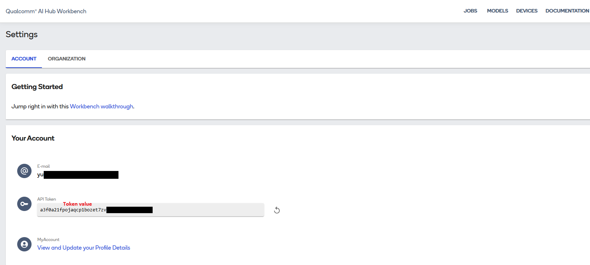

# PPE-Detection

PPE-Detection provides PPE-focused vision inference for edge devices, enabling real-time worker and safety-gear detection in industrial environments. It is suitable for rapid PoC and production deployment in factories, warehouses, logistics sites, and construction safety monitoring scenarios.

Upstream project: [qualcomm/gear_guard_net](https://github.com/qualcomm/ai-hub-models/tree/v0.53.1/src/qai_hub_models/models/gear_guard_net)

- **Category**: Industrial Safety Vision AI

  


## Gear Guard Net

- **PPE Detection Model(Gear Guard Net)**   
  Checks for required safety gear in real time, helping monitor PPE compliance in industrial environments. The model is based on a Qualcomm-developed architecture and is designed to run inference on general image inputs.

- **PPE Inference Pipeline**   
  Uses confidence score thresholds to identify PPE objects, supporting on-site safety monitoring and result visualization.

- **QNN DLC Optimization**   
  Uses QNN DLC runtime optimization with W8A16 quantization to improve inference efficiency while maintaining real-time performance and edge deployment feasibility.

## Supported Platform

| Platform | Hardware Spec | OS | Edge AI SDK | 
|---|---|---|---|
| [AIR-055](https://www.advantech.com/zh-tw/products/932c8818-07cc-4917-89e9-7a678ddc029c/air-055/mod_4e23ea2a-d196-4884-8c62-c31780fbafb0) | Qualcomm IQ-9075 - RAM: 36 GB, Storage: 128 GB | Ubuntu 24.04.3 LTS | [Install](https://docs.edge-ai-sdk.advantech.com/docs/Hardware/AI_System/Qualcomm/IQ9/AIR-055) |

---

# Setup

## Step 1. System Setup & Virtual Environment
```bash
# NOTE: 3.10 <= PYTHON_VERSION < 3.14 is supported.
mkdir /opt/Advantech/EdgeAI/EdgeAIHub
cd /opt/Advantech/EdgeAI/EdgeAIHub
git clone https://github.com/ADVANTECH-Corp/edge-ai-hub
cd edge-ai-hub/AI_Case/Industrial/PPE-Detection

python3 -m venv venv
source venv/bin/activate
pip install qai_hub_models==0.48.0 object-detection-metrics==0.4 aiofiles==25.1.0
```

## Step 2. Configure Qualcomm AI Hub
* Get API Token:
  Log in to [Qualcomm AI Hub](https://workbench.aihub.qualcomm.com/signin) and retrieve your API Token.
  `(Text in red is a sample; do not use the actual token shown.)`

  

* Configure Tool:
  ```
  qai-hub configure --api_token <YOUR_API_TOKEN>
  ```
---

# Development and Deployment

## Setup 1: RUN CLI Demo
```bash
cd /opt/Advantech/EdgeAI/EdgeAIHub/edge-ai-hub/AI_Case/Industrial/PPE-Detection

python -m qai_hub_models.models.gear_guard_net.demo \
--quantize w8a16 \
--target-runtime qnn_dlc \
--chipset qualcomm-qcs9075 \
--score-threshold 0.1 \
--eval-mode on-device \
--image ppe.jpg \
```


## Result
