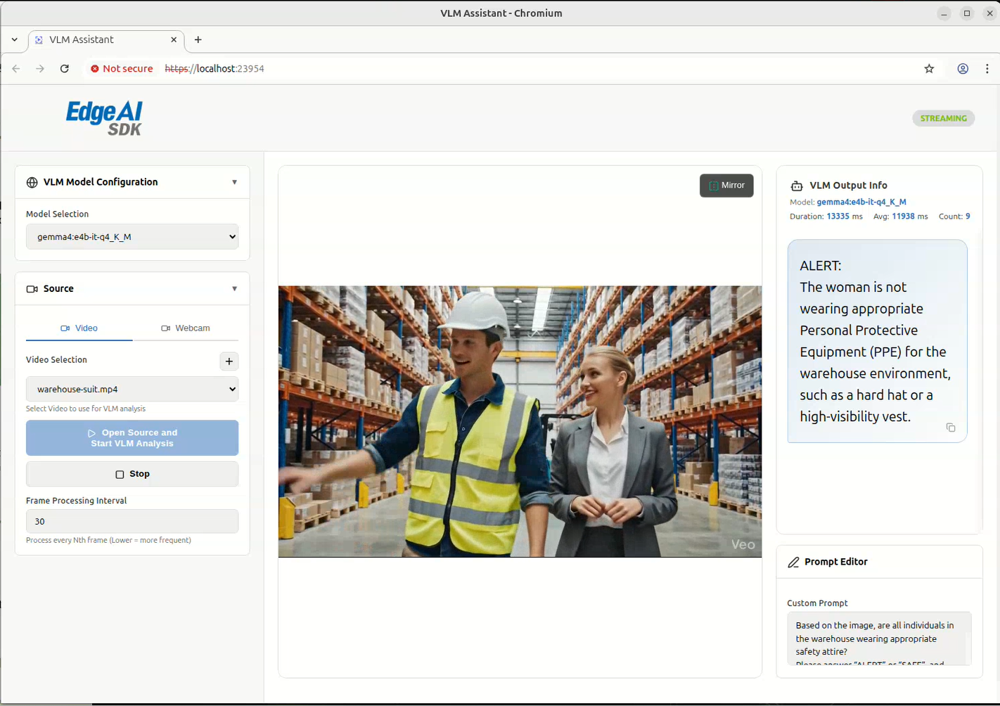

# VLM-Assistant for PPE Detection

VLM-Assistant can be used for PPE Detection in warehouse and industrial environments. It uses a GenAI vision model to periodically analyze camera images and determine whether workers are properly wearing the required personal protective equipment, such as protective clothing, safety helmets, reflective vests, gloves, and other safety gear.

The system provides fixed-interval visual descriptions of the current safety status, helping users monitor PPE compliance, identify potential safety issues, and support real-time worker safety management on edge devices.

This solution is suitable for rapid PoC validation and production deployment in factories, warehouses, logistics sites, and construction safety monitoring scenarios.


- **Category**: Industrial Safety GenAI

  


## GenAI Model

- **Default GenAI Engine: Ollama**   
  VLM-Assistant uses Ollama as the default GenAI inference engine for visual reasoning and safety-status description.

- **Default Model: gemma4:e4b-it-q4_K_M**   
  The default model is `gemma4:e4b-it-q4_K_M`, which is used to analyze image inputs and generate fixed-interval descriptions of whether workers are properly wearing required PPE.

- **PPE Detection Use Case**   
  The model checks for required safety gear such as protective clothing, safety helmets, reflective vests, gloves, and other PPE items. It helps monitor PPE compliance in warehouse, factory, logistics, and construction safety scenarios.
  
  **System Prompt**:
  ```
  Based on the image, are all individuals in the warehouse wearing appropriate safety attire?
  Please answer “ALERT” or “SAFE”, and provide a brief description.

  Response format:
  ALERT/SAFE:
  {{description}}
  ```

- **Edge Deployment**   
  The Ollama-based setup is designed for local inference and edge deployment, enabling periodic safety-status monitoring without relying on continuous cloud inference.

## Supported Platform

| Platform | Hardware Spec | OS | Edge AI SDK |
|---|---|---|---|
| [AIR-075](https://www.advantech.com/zh-tw/products/932c8818-07cc-4917-89e9-7a678ddc029c/air-075/mod_8489cdc1-ab25-48e3-a493-085d8db1860f) | NVIDIA Jetson Thor - RAM: 128/64 GB, Storage: 512 GB | JetPack 7.1 | [Install](https://docs.edge-ai-sdk.advantech.com/docs/Hardware/AI_System/Nvidia/Jetson%20Thor/AIR-075) |

---

## Prerequisites

- **Docker**: Required to run the VLM-Assistant and Ollama containers. Please install Docker before proceeding.
  - Install guide: https://docs.docker.com/engine/install/

---

## Setup

### System Setup & Virtual Environment
```bash
mkdir /opt/Advantech/EdgeAI/EdgeAIHub
cd /opt/Advantech/EdgeAI/EdgeAIHub
git clone https://github.com/ADVANTECH-Corp/edge-ai-hub
cd edge-ai-hub/AI_Case/Industrial/VLM-Assistant

# ENV: Pull docker: vlm-assistant, ollama / conda: media-gateway / Download model
sudo chmod u+x ./scripts/*.sh
sudo ./create_env.sh
```

---

## Development and Deployment

### RUN Demo
```bash
/opt/Advantech/EdgeAI/EdgeAIHub/edge-ai-hub/AI_Case/Industrial/VLM-Assistant/run.sh
/opt/Advantech/EdgeAI/EdgeAIHub/edge-ai-hub/AI_Case/Industrial/VLM-Assistant/run_browser.sh
```


### Result
