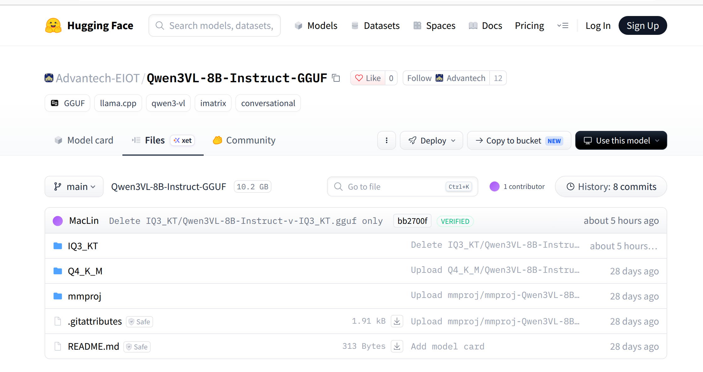
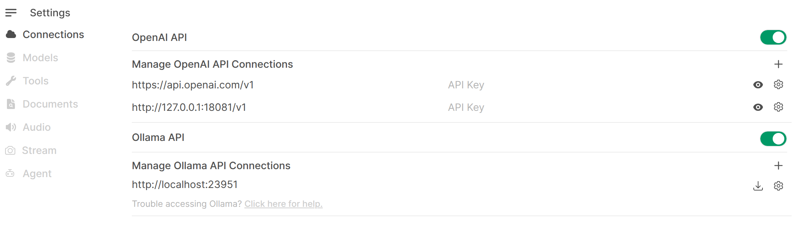
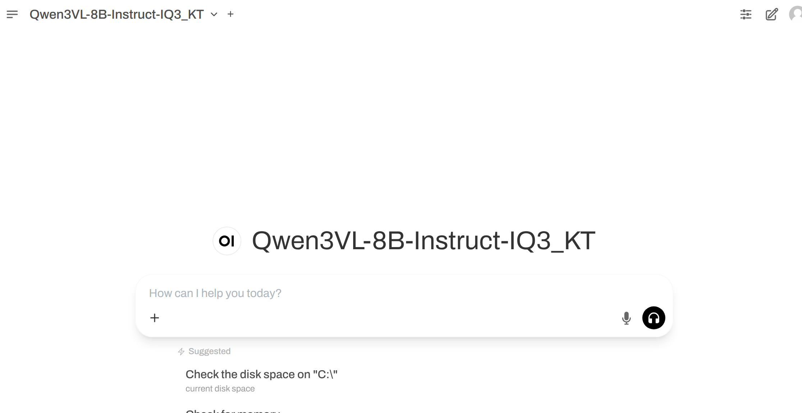
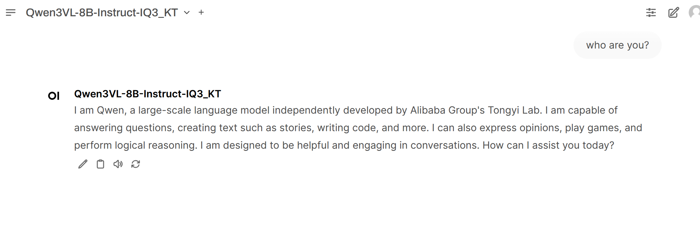
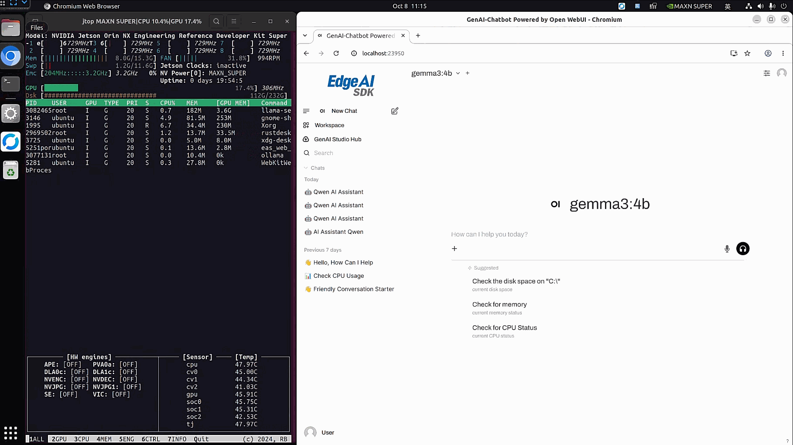
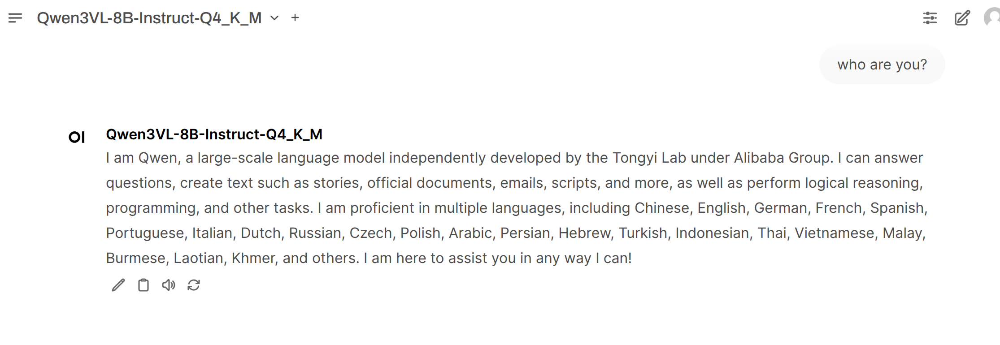
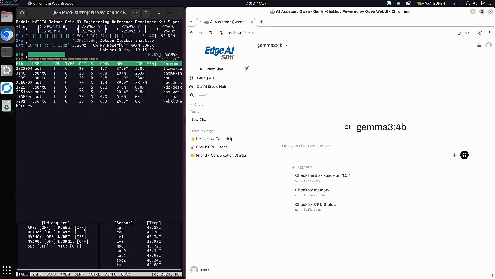

# IQ3_KT on NVIDIA Jetson

Deploy Qwen3VL-8B-Instruct with IQ3_KT quantization on an NVIDIA Jetson, expose a local OpenAI-compatible API, and chat through the existing Edge AI SDK Chatbot. This case also shows how to switch to Q4_K_M using the same runtime.

In this demonstration, IQ3_KT used approximately **1.8 GB less system RAM** than Q4_K_M, leaving more memory available on a memory-constrained Jetson. See the [RAM usage comparison](#ram-usage-comparison) for the demonstration results.

- **Category**: Model Optimization — Edge LLM
- **Model source**: [Advantech-EIOT/Qwen3VL-8B-Instruct-GGUF](https://huggingface.co/Advantech-EIOT/Qwen3VL-8B-Instruct-GGUF)
- **Chatbot documentation**: [Edge AI SDK Chatbot user guide](https://docs.edge-ai-sdk.advantech.com/docs/Turtorial/Document/GenAI_Chatbot)

## Contents

- [Model and Runtime](#model-and-runtime)
- [Supported Platform](#supported-platform)
- [Prerequisites](#prerequisites)
- [Setup](#setup)
- [Development and Deployment](#development-and-deployment)
- [Result](#result)
  - [IQ3_KT Demonstration](#iq3_kt-demonstration)
  - [Q4_K_M Demonstration](#q4_k_m-demonstration)
  - [RAM Usage Comparison](#ram-usage-comparison)
- [Stop](#stop)
- [Troubleshooting](#troubleshooting)

## Model and Runtime

- **Model**: Qwen3VL-8B-Instruct, provided as IQ3_KT and Q4_K_M GGUF files.
- **Runtime**: `advigw/iq3kt-llama-server:jp6_b8779`, the project's custom JP6 llama.cpp runtime. An arbitrary upstream llama.cpp image is not a replacement for IQ3_KT support.
- **Model storage**: GGUF files remain on the host and are mounted read-only. The runtime image does not contain the models.
- **Chat interface**: reuse the SDK's installed Chatbot. No second Open WebUI deployment is needed.

```text
Host GGUF model → Docker / native llama-server → Local API → Edge AI SDK Chatbot
```

| Service | Address |
|---|---|
| Chatbot — open in a browser on the Jetson | http://localhost:23950/ |
| OpenAI-compatible API base URL | `http://127.0.0.1:18081/v1` |

Run the commands on the target Jetson. This walkthrough uses the browser and SDK Chatbot on that same host; these localhost addresses do not expose the API to another computer.

This is a **text-only** walkthrough. It does not pass `--mmproj`; downloading a projector alone does not enable vision.

## Supported Platform

| Platform | Hardware | OS / Runtime Target | Edge AI SDK |
|---|---|---|---|
| AIR-021 | NVIDIA Jetson Orin NX, ARM64 (`aarch64`) | JetPack 6; L4T R36.4.3 / CUDA 12.6.11 | [Installation guide](https://docs.edge-ai-sdk.advantech.com/docs/Hardware/AI_System/Nvidia/Jetson%20Orin/AIR-021) |

Use a JetPack environment compatible with this JP6 runtime. The JP7 image is a separate build.

## Prerequisites

- Git, curl, Docker with NVIDIA Runtime, and a browser.
- The existing Edge AI SDK Chatbot, with normal login and administrator access to connection settings.
- Storage for both GGUF files and enough RAM for the loaded model, runtime buffers, and SDK. Model file size is not runtime RAM usage.
- Optionally, [jtop](https://github.com/rbonghi/jetson_stats) for observing system resources. It is not an API dependency.

## Setup

### Step 1: Download this project and prepare the directories

```bash
mkdir -p /home/ubuntu/Downloads
cd /home/ubuntu/Downloads
git clone https://github.com/ADVANTECH-Corp/edge-ai-hub.git
cd edge-ai-hub/AI_Case/Model-Optimization/IQ3_KT

mkdir -p /home/ubuntu/Downloads/iq3kt/models
chmod +x scripts/run_iq3kt.sh scripts/run_q4km.sh \
  scripts/stop_iq3kt.sh scripts/stop_q4km.sh
```

**Expected:** the case directory contains `README.md`, `assets/`, and the four scripts under `scripts/`.

If the repository is already cloned, open its `AI_Case/Model-Optimization/IQ3_KT` directory instead of cloning over an existing folder. The commands below assume the checkout is under `/home/ubuntu/Downloads/edge-ai-hub`.

Keep all four scripts together. They can run directly from `scripts/`; their model directory is fixed at `/home/ubuntu/Downloads/iq3kt/models`. You do not need to copy them into the model directory.

Check the NVIDIA Runtime and API port:

```bash
sudo docker info --format '{{json .Runtimes}}'
ss -ltn 'sport = :18081'
```

**Expected:** Docker's runtime list includes `nvidia`. An empty port listing means no TCP listener on 18081.

If the project's API is already running, wait for active requests to finish before switching. The scripts manage only `iq3kt-jp6-api` and refuse an unrelated listener. Do not kill an unknown service.

### Step 2: Download and place the models

Open the [model repository on Hugging Face](https://huggingface.co/Advantech-EIOT/Qwen3VL-8B-Instruct-GGUF). Choose **Files and versions**, open the matching folder, select the main GGUF file, and use its download control.

| Format | Main GGUF File | Size on Disk |
|---|---|---|
| IQ3_KT | [Qwen3VL-8B-Instruct-IQ3_KT.gguf](https://huggingface.co/Advantech-EIOT/Qwen3VL-8B-Instruct-GGUF/blob/bb2700f1f727c75f2b2c03d090438768d41b4316/IQ3_KT/Qwen3VL-8B-Instruct-IQ3_KT.gguf) | 3.47 GB · 3,470,051,840 bytes |
| Q4_K_M | [Qwen3VL-8B-Instruct-Q4_K_M.gguf](https://huggingface.co/Advantech-EIOT/Qwen3VL-8B-Instruct-GGUF/blob/bb2700f1f727c75f2b2c03d090438768d41b4316/Q4_K_M/Qwen3VL-8B-Instruct-Q4_K_M.gguf) | 5.03 GB · 5,027,784,800 bytes |

Place both files directly under `/home/ubuntu/Downloads/iq3kt/models/`.



For a terminal download, use these pinned URLs:

```bash
curl --fail --location --continue-at - \
  --output /home/ubuntu/Downloads/iq3kt/models/Qwen3VL-8B-Instruct-IQ3_KT.gguf \
  https://huggingface.co/Advantech-EIOT/Qwen3VL-8B-Instruct-GGUF/resolve/bb2700f1f727c75f2b2c03d090438768d41b4316/IQ3_KT/Qwen3VL-8B-Instruct-IQ3_KT.gguf

curl --fail --location --continue-at - \
  --output /home/ubuntu/Downloads/iq3kt/models/Qwen3VL-8B-Instruct-Q4_K_M.gguf \
  https://huggingface.co/Advantech-EIOT/Qwen3VL-8B-Instruct-GGUF/resolve/bb2700f1f727c75f2b2c03d090438768d41b4316/Q4_K_M/Qwen3VL-8B-Instruct-Q4_K_M.gguf
```

`--location` follows redirects, `--continue-at -` resumes an incomplete file, and `--fail` stops on an HTTP error. If both model files have finished downloading, skip these download commands.

### Step 3: Pull the runtime image

Acquire the runtime separately from starting the API:

```bash
sudo docker pull advigw/iq3kt-llama-server:jp6_b8779
sudo docker image ls advigw/iq3kt-llama-server:jp6_b8779
sudo docker image inspect advigw/iq3kt-llama-server:jp6_b8779 \
  --format '{{.Id}} {{.Os}}/{{.Architecture}}'
```

**Expected:** pull succeeds, the image is listed locally, and inspect reports `linux/arm64`.

`Image is up to date` means the image is already available locally. Pulling does not create an API container or download a model. The launch scripts start the API with the local image using `--pull=never`.

## Development and Deployment

### Step 1: Start IQ3_KT

```bash
cd /home/ubuntu/Downloads/edge-ai-hub/AI_Case/Model-Optimization/IQ3_KT
./scripts/stop_iq3kt.sh
sync
sudo sysctl -w vm.drop_caches=3
./scripts/run_iq3kt.sh
```

**Expected:** IQ3_KT loads and the server becomes ready. Wait for readiness, then press **Ctrl+C** to leave log following. The detached API container keeps running.

Cache clearing is demonstration preparation, not a requirement for every chat. `sync` flushes pending writes; `vm.drop_caches=3` releases clean page cache and reclaimable slab, including dentries/inodes. It does not empty all RAM or unload a running model. Stop the old model first.

<details>
<summary>Runtime settings used by the scripts</summary>

The scripts use NVIDIA Runtime, host networking, and a read-only model mount. Native llama-server binds to `127.0.0.1:18081` with context 4096, batch 1024, ubatch 512, GPU layers 99, K/V cache `q4_0`, Flash Attention on, and one parallel slot. The model alias is its filename without `.gguf`.

</details>

### Step 2: Check the API

```bash
curl --fail http://127.0.0.1:18081/health
curl --fail http://127.0.0.1:18081/v1/models
```

**Expected:** health returns `{"status":"ok"}`, and the model list contains `Qwen3VL-8B-Instruct-IQ3_KT`.

`/health` reports server readiness; `/v1/models` identifies the loaded model. If either check fails, inspect the server log before continuing.

### Step 3: Connect Edge AI SDK Chatbot

On the same Jetson, open **http://localhost:23950/** and sign in normally. Go to **Admin Settings → Connections → OpenAI**; labels may differ slightly between SDK versions.

1. Enable the OpenAI API if disabled.
2. Reuse a matching connection, or add the exact base URL below.
3. For this local API, leave the API key blank and use the Default / standard-compatible provider.
4. Save, reload, and check that the connection persists.

```text
http://127.0.0.1:18081/v1
```



Keep existing connections and chat data. If connection settings are unavailable, ask your SDK administrator for access.

### Step 4: Select IQ3_KT and send one message

Select `Qwen3VL-8B-Instruct-IQ3_KT`, open a new conversation, and send the following once:

```text
who are you?
```



**Expected:** the Chatbot displays an answer and finishes generating. Wait for completion before switching models. Identify the model from the selector and `/v1/models`, not from its self-description in the answer.

See the [IQ3_KT demonstration](#iq3_kt-demonstration) below.

### Step 5: Switch to Q4_K_M

Wait until IQ3_KT has finished. The two models share one API container and cannot be loaded by these scripts at the same time.

```bash
cd /home/ubuntu/Downloads/edge-ai-hub/AI_Case/Model-Optimization/IQ3_KT
./scripts/stop_iq3kt.sh
sync
sudo sysctl -w vm.drop_caches=3
./scripts/run_q4km.sh
```

Wait for readiness, then leave log following with **Ctrl+C**. Repeat the API checks:

```bash
curl --fail http://127.0.0.1:18081/health
curl --fail http://127.0.0.1:18081/v1/models
```

**Expected model ID:** `Qwen3VL-8B-Instruct-Q4_K_M`. The API base URL is unchanged.

Refresh the Chatbot model list, select Q4_K_M, and open a separate new conversation. Send `who are you?` once and wait for the complete visible response to finish. See the [Q4_K_M demonstration](#q4_k_m-demonstration) below.

## Result

The examples below show IQ3_KT and Q4_K_M responding to `who are you?` in Edge AI SDK Chatbot.

### IQ3_KT Demonstration



<details open>
<summary>IQ3_KT — Deployment and Chat Demo (show / hide animation)</summary>



</details>

### Q4_K_M Demonstration



<details open>
<summary>Q4_K_M — Deployment and Chat Demo (show / hide animation)</summary>



</details>

### RAM Usage Comparison

The inference demonstration shows system RAM usage of approximately **8.0 GB** with IQ3_KT and **9.8 GB** with Q4_K_M. In this demonstration, **IQ3_KT used about 1.8 GB less RAM than Q4_K_M**, leaving more memory available on a memory-constrained Jetson.

These are approximate system RAM readings shown in this demonstration, rather than model-only allocations or a peak/average benchmark for every workload.

## Stop

Stop the current model API without stopping SDK Chatbot or deleting models and chat data:

```bash
cd /home/ubuntu/Downloads/edge-ai-hub/AI_Case/Model-Optimization/IQ3_KT
./scripts/stop_iq3kt.sh
```

`stop_q4km.sh` targets the same API container. To restart or switch, use the corresponding run script. It checks the model, NVIDIA Runtime, and local image before replacing the project's container. Wait for active requests to finish first.

## Troubleshooting

| Issue | Action |
|---|---|
| Model missing or download incomplete | Place the named GGUF under `/home/ubuntu/Downloads/iq3kt/models/` and finish the download before starting. If the file is missing, the run script leaves the existing API untouched. |
| NVIDIA Runtime or image unavailable | Complete the prerequisite checks and image pull. Resolve host compatibility; do not substitute a different runtime blindly. |
| Port 18081 occupied | Identify the listener. The scripts manage only `iq3kt-jp6-api` and refuse an unrelated service. Avoid global container or process cleanup. |
| API not ready or model load failed | Check available memory and the server log below before continuing to Chatbot. |
| Chatbot missing the model or showing the old name | Recheck `/v1/models`, confirm the connection URL includes `/v1`, reload the model list, and select the currently loaded ID. |
| Chatbot unavailable or admin settings locked | Use the existing SDK Chatbot and normal login. Ask the SDK administrator to enable access; do not deploy another WebUI to conceal the issue. |
| Response incomplete | Wait for generation to finish. If the answer is cut off or an error appears, check the output limit and API logs. |

```bash
sudo docker logs iq3kt-jp6-api
```
