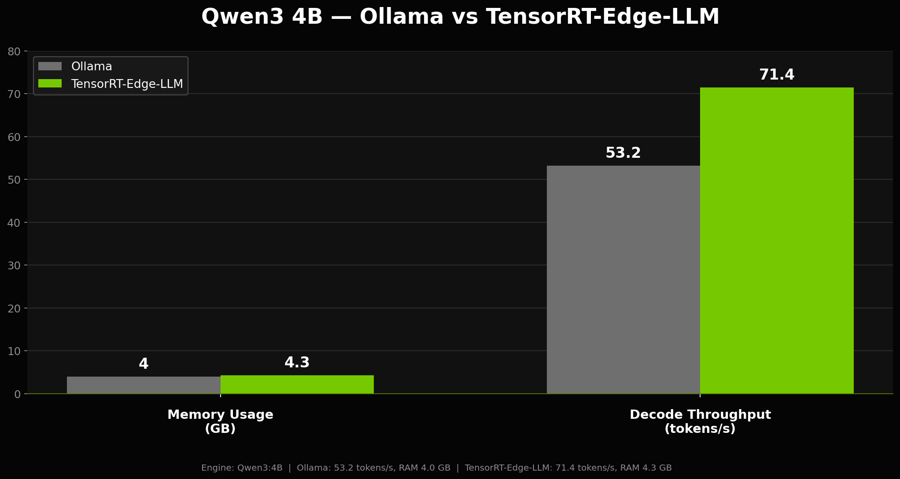
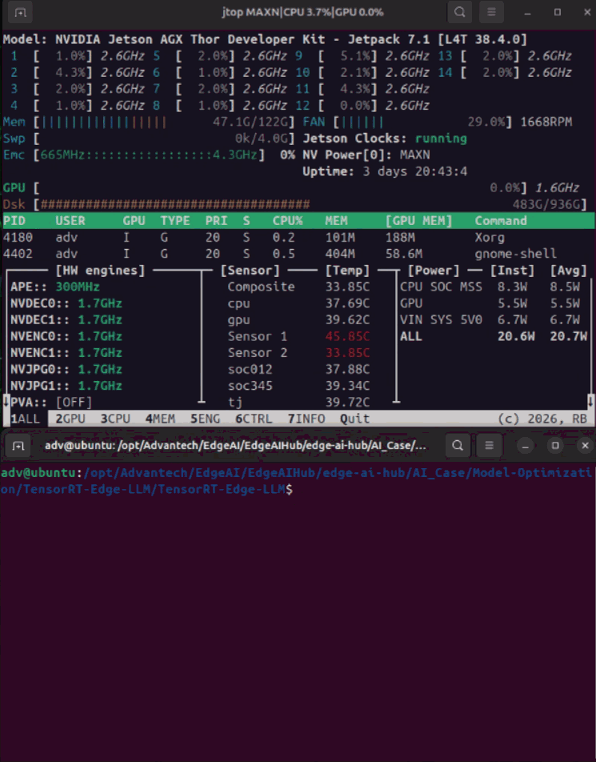

# NVIDIA TensorRT Edge-LLM

TensorRT Edge-LLM is NVIDIA’s optimized C++ inference runtime designed for running LLMs and VLMs on embedded platforms. Its deployment flow converts trained models into highly optimized TensorRT engines, which are then executed by a lightweight native runtime at inference time. Because the runtime loads and serves these engines directly without relying on Python in the inference path, it is better suited for production edge deployment. By supporting low-precision formats such as INT4, NVFP4, and FP8, TensorRT Edge-LLM can reduce model memory requirements, making larger models more feasible on devices with limited memory.

Upstream project: [TensorRT Edge-LLM on Jetson](https://www.jetson-ai-lab.com/tutorials/tensorrt-edge-llm/)

- **Category**: General-purpose Edge LLM



## TensorRT Edge-LLM

- **Qwen3-4B-Instruct LLM**
 Qwen3-4B-Instruct is used as the target text-only LLM for instruction-following, text generation, and edge-side chatbot inference.

- **TensorRT Edge-LLM Inference Pipeline**
 The Hugging Face model is downloaded on Jetson Thor, quantized to NVFP4, exported to ONNX, compiled into a TensorRT engine, and executed through the native C++ inference binary.

- **NVFP4 Runtime Optimization**
 NVFP4 quantization is used on Jetson Thor to reduce model weight footprint and improve edge deployment feasibility with TensorRT engine optimization.

## Supported Platform

| Platform | Hardware Spec | OS | Edge AI SDK |
|---|---|---|---|
| [AIR-075](https://www.advantech.com/zh-tw/products/932c8818-07cc-4917-89e9-7a678ddc029c/air-075/mod_8489cdc1-ab25-48e3-a493-085d8db1860f) | NVIDIA Jetson Thor - RAM: 128/64 GB, Storage: 512 GB | JetPack 7.1 | [Install](https://docs.edge-ai-sdk.advantech.com/docs/Hardware/AI_System/Nvidia/Jetson%20Thor/AIR-075) |

---

# Setup

## Step 1: Download this project

```bash
mkdir -p /opt/Advantech/EdgeAI/EdgeAIHub
cd /opt/Advantech/EdgeAI/EdgeAIHub
git clone https://github.com/ADVANTECH-Corp/edge-ai-hub
cd edge-ai-hub/AI_Case/Model-Optimization/TensorRT-Edge-LLM
```

Expected: the project should be downloaded and the working directory should point to this AI Case.

## Step 2: Use NVIDIA PyTorch Container on Jetson Thor

```bash
docker compose up -d
docker exec -it trtedgellm-export bash
```

Expected: the NVIDIA PyTorch container should start on Jetson Thor with the current directory mounted to `/workspace`.

## Step 3: Install TensorRT Edge-LLM inside the container

```bash
git clone https://github.com/NVIDIA/TensorRT-Edge-LLM.git
cd TensorRT-Edge-LLM
git checkout v0.7.1
git submodule update --init --recursive

python3 -m venv --system-site-packages venv
source venv/bin/activate

pip3 install --no-deps .
sed '/^torch/d' requirements.txt > /tmp/reqs.txt
pip3 install -r /tmp/reqs.txt

export WORKSPACE_DIR=/workspace/tensorrt-edgellm-workspace
```

Expected: TensorRT Edge-LLM export and quantization tools should be available inside the container.

## Step 4: Verify TensorRT Edge-LLM export tools

```bash
tensorrt-edgellm-export-llm --help
tensorrt-edgellm-quantize-llm --help
```

Expected: both commands should print usage information without errors.

## Step 5: Download, quantize, and export Qwen3-4B-Instruct to NVFP4 ONNX on Jetson Thor

```bash
export MODEL_NAME=Qwen3-4B-Instruct

mkdir -p "${WORKSPACE_DIR}"
cd "${WORKSPACE_DIR}"

rm -rf "${MODEL_NAME}/quantized" "${MODEL_NAME}/onnx"

tensorrt-edgellm-quantize-llm \
    --model_dir Qwen/Qwen3-4B-Instruct-2507 \
    --output_dir "${MODEL_NAME}/quantized" \
    --quantization nvfp4 \
    --dataset_dir abisee/cnn_dailymail

tensorrt-edgellm-export-llm \
    --model_dir "${MODEL_NAME}/quantized" \
    --output_dir "${MODEL_NAME}/onnx"
exit
```

Expected: the Qwen3-4B-Instruct model should be downloaded, quantized to NVFP4, and exported to ONNX under `tensorrt-edgellm-workspace/Qwen3-4B-Instruct/onnx`.

---

# Development and Deployment

## Setup 1: Exit the Container and Build the C++ Runtime on Jetson Thor


```bash
cd "$(dirname "$0")"

sudo chown -R "$(whoami):$(whoami)" tensorrt-edgellm-workspace
sudo chown -R "$(whoami):$(whoami)" TensorRT-Edge-LLM

sudo apt update
sudo apt install -y \
    cmake \
    build-essential \
    git \
    cuda-toolkit-13-0 \
    libnvinfer-headers-dev \
    libnvinfer-dev \
    libnvonnxparsers-dev

export PATH=/usr/local/cuda/bin:${PATH}
```

```bash
cd TensorRT-Edge-LLM
rm -rf build
mkdir build
cd build

cmake .. \
    -DCMAKE_BUILD_TYPE=Release \
    -DTRT_PACKAGE_DIR=/usr \
    -DCMAKE_TOOLCHAIN_FILE=cmake/aarch64_linux_toolchain.cmake \
    -DEMBEDDED_TARGET=jetson-thor

make -j"$(nproc)"

```

Expected: the TensorRT Edge-LLM C++ runtime should be built successfully for Jetson Thor.

## Setup 2: Build the Qwen3-4B-Instruct TensorRT engine with NVFP4 ONNX

```bash
cd "/opt/Advantech/EdgeAI/EdgeAIHub/edge-ai-hub/AI_Case/Model-Optimization/TensorRT-Edge-LLM/TensorRT-Edge-LLM"

export MODEL_NAME=Qwen3-4B-Instruct
export WORKSPACE_DIR="/opt/Advantech/EdgeAI/EdgeAIHub/edge-ai-hub/AI_Case/Model-Optimization/TensorRT-Edge-LLM/tensorrt-edgellm-workspace"
export EDGELLM_PLUGIN_PATH="/opt/Advantech/EdgeAI/EdgeAIHub/edge-ai-hub/AI_Case/Model-Optimization/TensorRT-Edge-LLM/TensorRT-Edge-LLM/build/libNvInfer_edgellm_plugin.so"

mkdir -p "${WORKSPACE_DIR}/${MODEL_NAME}/engine"

./build/examples/llm/llm_build \
    --onnxDir "${WORKSPACE_DIR}/${MODEL_NAME}/onnx" \
    --engineDir "${WORKSPACE_DIR}/${MODEL_NAME}/engine" \
    --maxBatchSize 1 \
    --maxInputLen 1024 \
    --maxKVCacheCapacity 4096
```

Expected: the optimized TensorRT engine should be generated under `tensorrt-edgellm-workspace/Qwen3-4B-Instruct/engine`.

## Setup 3: Create an input prompt file

```bash
WORKSPACE_DIR="/opt/Advantech/EdgeAI/EdgeAIHub/edge-ai-hub/AI_Case/Model-Optimization/TensorRT-Edge-LLM/tensorrt-edgellm-workspace"

mkdir -p "${WORKSPACE_DIR}"

cat > "${WORKSPACE_DIR}/input_qwen.json" << 'EOF_JSON'
{
    "batch_size": 1,
    "temperature": 1.0,
    "top_p": 1.0,
    "top_k": 50,
    "max_generate_length": 512,
    "requests": [
        {
            "messages": [
                {
                    "role": "user",
                    "content": "Explain the benefits of running large language models locally on NVIDIA Jetson Thor."
                }
            ]
        }
    ]
}
EOF_JSON

echo "Created: ${WORKSPACE_DIR}/input_qwen.json"
```

Expected: the input prompt file should be created at `tensorrt-edgellm-workspace/input_qwen.json`.

## Setup 4: Run Qwen3-4B-Instruct inference on Jetson Thor

```bash
export WORKSPACE_DIR=/opt/Advantech/EdgeAI/EdgeAIHub/edge-ai-hub/AI_Case/Model-Optimization/TensorRT-Edge-LLM/tensorrt-edgellm-workspace

./build/examples/llm/llm_inference \
    --engineDir $WORKSPACE_DIR/Qwen3-4B-Instruct/engine \
    --inputFile $WORKSPACE_DIR/input_qwen.json \
    --outputFile $WORKSPACE_DIR/output_qwen.json \
    --dumpOutput
```

Expected: Qwen3-4B-Instruct should generate a text response using the TensorRT engine on Jetson Thor.

## Setup 5: Check output

```bash
cat $WORKSPACE_DIR/output_qwen.json
```

Expected: the output JSON should contain the generated response from Qwen3-4B-Instruct.

## Result


